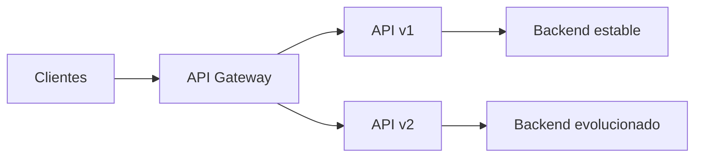

# Versionando APIs

Las APIs evolucionan al mismo ritmo que los productos que exponen. Podemos añadir funcionalidades, corregir errores, mejorar el modelo de datos o adaptar una integración a nuevas necesidades. El problema aparece cuando un cambio modifica el contrato que ya utilizan otros clientes.

Versionar una API permite evolucionar sin romper de forma inesperada las integraciones existentes. En lugar de obligar a todos los consumidores a migrar al mismo tiempo, podemos mantener una versión estable, publicar una nueva y dar a cada cliente un periodo razonable para actualizarse.

## ¿Por qué versionar una API?

Una API no es solo código: es un contrato entre quien la publica y quien la consume. Ese contrato incluye rutas, métodos HTTP, parámetros, encabezados, formatos de petición, respuestas y códigos de error.

Versionar ayuda a:

- Evitar que un cambio incompatible rompa aplicaciones web, móviles o de terceros.
- Incorporar nuevas funcionalidades sin alterar el comportamiento esperado por los clientes actuales.
- Corregir errores o rediseñar modelos de datos de forma gradual.
- Migrar una implementación interna sin obligar a todos los consumidores a conocerla.
- Medir el uso de cada versión y planificar su retirada.
- Comunicar con claridad qué versión debe utilizar cada consumidor.

Una forma sencilla de verlo es pensar en una dirección. Si cambiamos el destino de una ruta sin avisar, quienes la utilizan pueden dejar de llegar a donde esperaban. Al publicar `v1` y `v2`, cada cliente sabe qué contrato está usando y puede decidir cuándo cambiar de ruta.

## Cambios compatibles e incompatibles

No todos los cambios necesitan una nueva versión mayor. La decisión depende de si el cambio conserva el contrato existente.

### Cambios normalmente compatibles

Estos cambios suelen poder publicarse dentro de la misma versión, siempre que los clientes toleren la evolución del contrato:

- Añadir un endpoint nuevo.
- Añadir un campo opcional en una respuesta.
- Aceptar un nuevo valor de entrada sin cambiar los valores existentes.
- Mejorar el rendimiento sin alterar el comportamiento observable.
- Añadir documentación o ejemplos.

Incluso en estos casos conviene revisar el impacto. Un cliente que deserializa estrictamente una respuesta podría fallar al recibir campos nuevos, aunque el cambio parezca compatible en teoría.

### Cambios incompatibles

Es recomendable crear una nueva versión cuando se modifica el contrato de forma que un cliente existente puede dejar de funcionar. Algunos ejemplos son:

- Eliminar o renombrar un endpoint, parámetro o campo.
- Cambiar el tipo o el significado de un campo.
- Modificar una ruta o un método HTTP.
- Hacer obligatorio un parámetro que antes era opcional.
- Cambiar el formato de una respuesta o los códigos de error esperados.
- Alterar las reglas de autenticación o autorización de forma incompatible.
- Cambiar una operación de manera que produzca efectos secundarios distintos.

La pregunta práctica es: **¿un consumidor que funcionaba ayer puede seguir funcionando sin modificar su código?** Si la respuesta es no, estamos ante un cambio incompatible y debemos planificar una estrategia de versionado.

## Versionamiento semántico

El versionamiento semántico, conocido como **SemVer**, es una convención para comunicar el impacto de los cambios mediante una versión con el formato `MAJOR.MINOR.PATCH`:

- **MAJOR**: cambios incompatibles con la versión anterior.
- **MINOR**: nuevas funcionalidades compatibles con los clientes existentes.
- **PATCH**: correcciones compatibles, normalmente sin cambios en el contrato.

Por ejemplo, si una API está en `1.4.2`:

- `1.4.3` puede corregir un error en la validación de fechas sin modificar el contrato.
- `1.5.0` puede añadir `GET /reports` o un filtro opcional como `?status=active`.
- `2.0.0` puede reemplazar `customerName` por una estructura `customer`, eliminar un endpoint o cambiar el significado de un campo.

La regla central es que cada número comunica compatibilidad hacia atrás:

1. Si se corrige un defecto sin cambiar el contrato, se incrementa `PATCH` y se reinicia `MINOR` y `PATCH` cuando corresponda.
2. Si se añade funcionalidad compatible, se incrementa `MINOR` y el valor de `PATCH` vuelve a cero.
3. Si se introduce un cambio incompatible, se incrementa `MAJOR` y `MINOR` y `PATCH` vuelven a cero.

Así, una secuencia como `1.4.2 -> 1.4.3 -> 1.5.0 -> 2.0.0` permite entender rápidamente qué tipo de cambio se produjo.

### ¿Qué significa compatible en una API?

Considera este contrato:

```http
GET /v1/products/42
```

Respuesta original:

```json
{
  "id": 42,
  "name": "Teclado",
  "price": 19990
}
```

Estos cambios suelen ser compatibles:

- Añadir un endpoint nuevo, como `GET /v1/products/{id}/reviews`.
- Añadir un campo opcional como `currency` en la respuesta.
- Añadir un parámetro de consulta opcional, por ejemplo `?category=office`.
- Aceptar un nuevo formato de entrada sin dejar de aceptar el anterior.

Estos cambios pueden romper consumidores y deberían tratarse como `MAJOR`:

- Cambiar `price` de número a un objeto como `{ "amount": 19990, "currency": "CLP" }`.
- Renombrar `name` a `productName` o eliminar `price`.
- Hacer obligatorio un parámetro que antes no era necesario.
- Cambiar `200 OK` por `202 Accepted` cuando el cliente esperaba que la operación ya hubiera terminado.
- Cambiar un error `404 Not Found` por `200 OK` con una respuesta vacía si el consumidor depende del código de error.
- Modificar el significado de una operación, por ejemplo hacer que `DELETE` archive un recurso cuando antes lo eliminaba.

La compatibilidad también depende de los clientes reales. Añadir campos a JSON suele considerarse compatible, pero un consumidor que deserializa de forma estricta podría rechazar una respuesta con propiedades desconocidas. Por eso conviene combinar SemVer con pruebas de contrato y conocimiento de los consumidores.

### Versiones iniciales y pre-releases

Mientras una API todavía está en diseño, puede utilizarse una versión `0.y.z`. SemVer interpreta que el contrato aún puede cambiar y que no existe la misma promesa de estabilidad que en una versión `1.0.0` o superior. Por ejemplo, `0.3.0` puede introducir cambios incompatibles sin saltar a `1.0.0`, siempre que esa inestabilidad esté claramente documentada.

Una versión puede incluir una etiqueta de pre-release:

```text
2.0.0-alpha.1
2.0.0-beta.2
2.0.0-rc.1
```

Estas versiones sirven para pruebas controladas. Una pre-release no debe presentarse como equivalente a `2.0.0` estable, porque todavía puede cambiar antes de su publicación definitiva. SemVer también permite metadatos de compilación, por ejemplo `1.5.0+build.184`, que ayudan a identificar un artefacto sin cambiar su precedencia funcional.

### SemVer y la versión pública de la API

SemVer describe la evolución del contrato, pero no obliga a exponer los tres números en la URL. Es posible que una plataforma publique `v1` en el API Gateway mientras internamente despliega varias revisiones compatibles, como `1.2.0` y `1.2.1`.

Una práctica habitual es:

- Usar la versión mayor en la ruta pública: `/v1` y `/v2`.
- Mantener `MINOR` y `PATCH` en la documentación, el catálogo o los encabezados de respuesta.
- Registrar la versión exacta desplegada para facilitar trazabilidad y soporte.

Por tanto, `v1` no significa necesariamente que solo exista `1.0.0`; significa que el consumidor está utilizando la familia de contratos compatibles de la versión mayor 1. La convención debe explicarse en la documentación para evitar ambigüedades.

### Lo que SemVer no decide

SemVer no determina por sí solo:

- Cuánto tiempo debe mantenerse una versión antigua.
- Si la versión debe aparecer en la URL, un header o un media type.
- Cómo migrar los datos internos del backend.
- Qué clientes deben autorizarse para cada versión.
- Cuándo una API está lista para pasar de `0.x` a `1.0.0`.

Esas decisiones forman parte de la política de gobierno de APIs y deben coordinarse con el API Gateway, la documentación, las pruebas y los equipos consumidores.

SemVer es, por tanto, un lenguaje común para comunicar el impacto de los cambios. No sustituye por sí solo el mecanismo que utiliza el consumidor para seleccionar una versión; para eso necesitamos expresar la versión en la propia API mediante la estrategia que elijamos.

## Estrategias para versionar una API

No existe una estrategia universal. La elección debe ser coherente con las convenciones del proyecto, las capacidades de la plataforma y la experiencia de los consumidores.

### Versión en la URL

La versión forma parte de la ruta:

```text
https://api.ejemplo.com/v1/orders
https://api.ejemplo.com/v2/orders
```

Es una opción muy visible y sencilla de probar con un navegador, `curl` o Postman. También facilita que el API Gateway enrute cada versión hacia el backend correspondiente.

Su principal coste es que la versión queda expuesta como parte del recurso. En la práctica es una estrategia muy extendida por su claridad y facilidad de operación.

### Versión como parámetro de consulta

La versión se envía como parte de la query string:

```text
https://api.ejemplo.com/orders?version=1
```

Es fácil de introducir en clientes existentes, pero puede resultar menos clara y más difícil de gobernar si diferentes herramientas tratan los parámetros de forma distinta. Además, la versión no siempre queda reflejada de manera evidente en la documentación o en las cachés.

### Versión mediante encabezados

El cliente indica la versión con un encabezado:

```http
GET /orders HTTP/1.1
Host: api.ejemplo.com
X-API-Version: 2
```

La URL permanece estable y el contrato puede evolucionar de forma más limpia desde el punto de vista de los recursos. A cambio, las solicitudes son menos visibles y sencillas de probar, y es necesario documentar bien el encabezado.

### Negociación de contenido

La versión se expresa mediante el encabezado `Accept` y un media type específico:

```http
Accept: application/vnd.ejemplo.orders.v2+json
```

Esta estrategia aprovecha la negociación de contenido de HTTP, pero aumenta la complejidad de configuración, documentación y depuración. Conviene utilizarla cuando el equipo ya trabaja con media types y tiene una necesidad clara de separar representaciones.

### Comparación rápida

| Estrategia | Ventaja principal | Coste principal |
| --- | --- | --- |
| URL | Visible y fácil de probar | La versión forma parte de la ruta pública |
| Query string | Sencilla de añadir a clientes existentes | Menos explícita y más dependiente de la infraestructura |
| Header | Mantiene limpia la URL | Menos visible y más difícil de probar manualmente |
| Media type | Usa mecanismos estándar de HTTP | Mayor complejidad para clientes y herramientas |

Para una primera API pública, la versión en la URL suele ser una opción pragmática. Lo importante es elegir una convención y mantenerla de forma consistente.

## Versionar con un API Gateway

El API Gateway es la puerta principal frente a aplicaciones web, móviles, partners y otros microservicios. Por eso es un lugar natural para centralizar el enrutamiento y las políticas de varias versiones.

Un flujo típico podría ser:



El gateway puede:

- Exponer rutas como `/v1` y `/v2`.
- Dirigir cada versión al backend adecuado.
- Aplicar autenticación, autorización, cuotas y límites por versión.
- Medir solicitudes, errores y latencia de cada contrato.
- Realizar despliegues graduales o *rollouts* controlados.
- Mantener oculta la topología interna de los microservicios.

Esto no significa que el gateway deba contener la lógica de negocio. Su función es controlar el tráfico y aplicar políticas; cada backend sigue siendo responsable de sus reglas de dominio y de cumplir el contrato que ofrece.

## Ejemplo de evolución

Supongamos que `v1` devuelve un pedido con un campo `total` como número:

```json
{
  "id": "A-100",
  "total": 12500
}
```

En una nueva versión queremos separar el importe y la moneda:

```json
{
  "id": "A-100",
  "amount": 12500,
  "currency": "CLP"
}
```

Eliminar `total` y sustituirlo directamente por `amount` podría romper clientes que todavía leen `total`. Una alternativa es publicar `v2`, mantener `v1` durante la transición y ofrecer una guía para actualizar el consumo.

El cliente podrá utilizar, por ejemplo:

```text
GET https://api.ejemplo.com/v1/orders/A-100
GET https://api.ejemplo.com/v2/orders/A-100
```

## Proceso de deprecación

Una versión antigua no debería desaparecer sin aviso. La deprecación es el proceso mediante el cual comunicamos que una versión dejará de recibir soporte y damos tiempo para migrar.

### 1. Avisar oficialmente

Publica la decisión en la documentación, contacta a los integradores y, cuando corresponda, utiliza encabezados HTTP como:

```http
Deprecation: true
Sunset: 2025-12-01
```

La fecha debe ser realista y estar acompañada de una explicación clara.

### 2. Comunicar la migración

Indica la fecha límite, las diferencias entre versiones, los cambios incompatibles y una guía paso a paso. Los consumidores necesitan saber qué deben modificar, no solo que existe una versión nueva.

### 3. Mantener la coexistencia

Mantén `/v1` y `/v2` disponibles durante un periodo definido. La duración depende del tipo de consumidores, del riesgo del cambio y de la frecuencia con que puedan desplegar sus aplicaciones.

### 4. Medir el uso

Observa el tráfico, los errores, la latencia y el consumo por versión y por cliente. No retires `v1` solo porque exista `v2`: primero confirma que los consumidores importantes ya han migrado o que existe un plan explícito para ellos.

### 5. Retirar de forma controlada

Cuando termine el periodo de transición:

1. Revisa de nuevo el tráfico restante.
2. Contacta a los consumidores que todavía utilicen la versión antigua.
3. Deshabilita las rutas de forma planificada.
4. Documenta el cierre y conserva la información necesaria para auditoría.
5. Elimina progresivamente los recursos que ya no sean necesarios.

En algunos entornos puede ser preferible redirigir temporalmente, devolver una respuesta de migración o bloquear el acceso con un mensaje explícito. No conviene redirigir automáticamente una API si el contrato cambió, porque el cliente podría recibir una respuesta incompatible sin saberlo.

## Buenas prácticas

- Define una política de versionado antes de publicar la primera API.
- Versiona contratos, no únicamente el código del backend.
- Mantén una sola convención de versionado dentro de un producto o plataforma.
- Documenta cada versión con OpenAPI y ejemplos de solicitudes y respuestas.
- Automatiza pruebas de compatibilidad para detectar cambios incompatibles.
- Publica un registro de cambios (*changelog*) y una guía de migración.
- Evita crear una nueva versión por cada pequeña modificación compatible.
- Mide el uso por consumidor, endpoint y versión.
- Define de antemano la política de soporte y retirada.
- Trata la seguridad como parte del contrato: un cambio en autenticación o permisos también puede requerir una nueva versión.
- Usa despliegues graduales cuando el cambio tenga un riesgo elevado.
- No mantengas versiones antiguas indefinidamente; tienen un coste operativo y de seguridad.

## Resumen

Versionar APIs permite evolucionar un contrato sin romper a los consumidores actuales. Los cambios incompatibles suelen requerir una nueva versión, mientras que los cambios compatibles pueden mantenerse dentro de la versión existente con una documentación adecuada.

El API Gateway centraliza el acceso a varias versiones, aplica políticas y proporciona métricas para controlar la migración. El trabajo no termina al publicar `v2`: hay que comunicar la deprecación de `v1`, mantener ambas durante un periodo razonable, observar el uso y retirar la versión antigua de forma controlada.

La estrategia concreta, ya sea mediante URL, query string, encabezados o negociación de contenido, importa menos que la consistencia, la documentación y la capacidad de acompañar a los consumidores durante todo el ciclo de vida.

## Recursos

- [Semantic Versioning 2.0.0](https://semver.org/)
- [RFC 8594: The Sunset HTTP Header Field](https://www.rfc-editor.org/rfc/rfc8594)
- [Amazon API Gateway](https://aws.amazon.com/es/api-gateway/)
- [Azure API Management](https://azure.microsoft.com/es-es/products/api-management)
