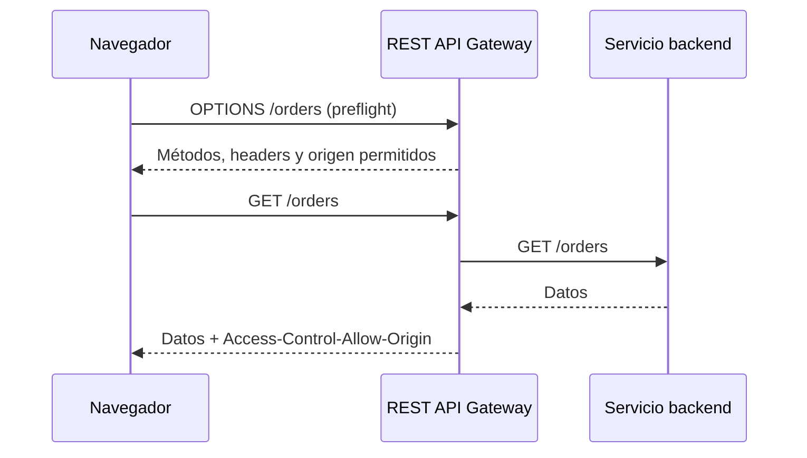

# CORS: compartiendo APIs entre orígenes

Cuando una aplicación web se ejecuta en `https://app.ejemplo.com` y necesita consumir una API publicada en `https://api.ejemplo.com`, el navegador detecta que la solicitud cruza un límite de origen. Aunque ambos dominios pertenezcan al mismo proyecto, sus **orígenes** son distintos.

En ese escenario entra en juego **CORS** (*Cross-Origin Resource Sharing* o intercambio de recursos entre orígenes). CORS es un mecanismo basado en encabezados HTTP que permite que un servidor indique qué aplicaciones web de otros orígenes pueden acceder a sus respuestas.

## El origen y la política de mismo origen

Un origen está formado por tres elementos:

- Esquema o protocolo, como `http` o `https`.
- Host o dominio, como `app.ejemplo.com`.
- Puerto, como `443` o `8080`.

Por ejemplo, estos orígenes son diferentes:

```text
https://app.ejemplo.com
https://api.ejemplo.com
http://app.ejemplo.com
https://app.ejemplo.com:8080
```

El navegador aplica por defecto la **same-origin policy** o política de mismo origen. Esta política evita que cualquier página web pueda leer libremente las respuestas de servicios ubicados en otros orígenes utilizando las credenciales del usuario.

La política de mismo origen no impide que una página envíe cualquier tipo de tráfico en todos los casos. Lo que controla especialmente es si el código JavaScript de un origen puede leer la respuesta de otro origen. CORS permite relajar esa restricción de forma explícita y controlada.

## ¿Para qué se usan las políticas CORS?

Una política CORS sirve para expresar reglas como:

- Qué orígenes pueden realizar solicitudes desde el navegador.
- Qué métodos HTTP están permitidos.
- Qué encabezados puede enviar el cliente.
- Qué encabezados de respuesta puede leer el código JavaScript.
- Si la solicitud puede incluir credenciales, como cookies o certificados TLS de cliente.
- Durante cuánto tiempo el navegador puede recordar el resultado de una solicitud previa.

Supongamos que el frontend se carga desde `https://app.ejemplo.com`. Para permitir que llame a una API, el servidor puede responder:

```http
Access-Control-Allow-Origin: https://app.ejemplo.com
```

El navegador compara ese valor con el origen de la página que hizo la solicitud. Si la respuesta no autoriza ese origen, el navegador bloquea el acceso de JavaScript a la respuesta y muestra un error CORS en la consola.

> CORS es una negociación entre el navegador y el servidor. No es una autorización de negocio ni reemplaza OAuth 2.0, API keys, IAM u otros mecanismos de autenticación.

## Solicitudes simples y preflight

El navegador no trata todas las solicitudes de la misma forma. Dependiendo del método, los encabezados y el tipo de contenido, puede enviar la solicitud directamente o hacer primero una comprobación llamada **preflight**.

### Solicitud simple

Una solicitud puede considerarse simple cuando utiliza, entre otras condiciones, un método `GET`, `HEAD` o `POST` permitido y encabezados considerados simples. Por ejemplo:

```http
GET /products HTTP/1.1
Host: api.ejemplo.com
Origin: https://app.ejemplo.com
```

El servidor debe incluir en su respuesta un encabezado que autorice el origen:

```http
HTTP/1.1 200 OK
Access-Control-Allow-Origin: https://app.ejemplo.com
Content-Type: application/json

{"items": []}
```

La solicitud puede llegar al backend antes de que el navegador compruebe la respuesta. Si CORS no está configurado correctamente, el navegador impedirá que el frontend lea el resultado, aunque el servidor haya procesado la petición.

### Solicitud preflight

Una solicitud que usa métodos como `PUT`, `PATCH` o `DELETE`, encabezados personalizados o ciertos tipos de contenido suele requerir una comprobación previa. El navegador envía una solicitud `OPTIONS` para preguntar si la operación está permitida:

```http
OPTIONS /products/42 HTTP/1.1
Host: api.ejemplo.com
Origin: https://app.ejemplo.com
Access-Control-Request-Method: PUT
Access-Control-Request-Headers: authorization, content-type
```

El servidor o API Gateway debe responder con las reglas aplicables:

```http
HTTP/1.1 204 No Content
Access-Control-Allow-Origin: https://app.ejemplo.com
Access-Control-Allow-Methods: GET, PUT, OPTIONS
Access-Control-Allow-Headers: authorization, content-type
Access-Control-Max-Age: 600
```

Solo después de recibir una respuesta válida el navegador enviará la solicitud real:

```http
PUT /products/42 HTTP/1.1
Origin: https://app.ejemplo.com
Authorization: Bearer <token>
Content-Type: application/json

{"price": 24990}
```

`OPTIONS` no es la operación de negocio. Es una consulta automática del navegador para verificar las condiciones de CORS.

## Encabezados principales

### `Access-Control-Allow-Origin`

Indica qué origen puede leer la respuesta:

```http
Access-Control-Allow-Origin: https://app.ejemplo.com
```

También puede utilizarse `*` para permitir cualquier origen en solicitudes sin credenciales:

```http
Access-Control-Allow-Origin: *
```

No se debe combinar `Access-Control-Allow-Origin: *` con `Access-Control-Allow-Credentials: true`. Si se necesitan cookies o credenciales, hay que indicar los orígenes permitidos de forma explícita.

### `Access-Control-Allow-Methods`

Indica qué métodos pueden utilizarse en una solicitud cross-origin, especialmente como respuesta al preflight:

```http
Access-Control-Allow-Methods: GET, POST, PUT, DELETE, OPTIONS
```

Debe incluir el método que el navegador pretende utilizar.

### `Access-Control-Allow-Headers`

Indica qué encabezados puede enviar el cliente. Por ejemplo, una API que utiliza un token Bearer y JSON podría necesitar:

```http
Access-Control-Allow-Headers: authorization, content-type
```

Si el frontend envía un encabezado personalizado, como `X-Client-Version`, también debe estar permitido.

### `Access-Control-Allow-Credentials`

Permite que el navegador incluya credenciales en una solicitud cross-origin, como cookies o certificados TLS de cliente:

```http
Access-Control-Allow-Credentials: true
```

El servidor debe combinarlo con un origen concreto, nunca con `*`. Además, permitir credenciales no significa que el usuario esté autenticado: solo indica que el navegador puede incluirlas si la aplicación y la política lo permiten.

### `Access-Control-Expose-Headers`

Por defecto, JavaScript no puede leer todos los encabezados de una respuesta cross-origin. Si la API necesita exponer, por ejemplo, `X-Request-Id` o `Content-Disposition`, debe declararlo:

```http
Access-Control-Expose-Headers: X-Request-Id, Content-Disposition
```

### `Access-Control-Max-Age`

Indica durante cuánto tiempo el navegador puede reutilizar el resultado del preflight. Un valor moderado reduce solicitudes `OPTIONS`, pero una duración demasiado larga puede retrasar la aplicación de cambios en la política.

## CORS en una REST API

En una REST API, CORS se configura en la capa que recibe la solicitud, que puede ser un API Gateway, un reverse proxy o el propio servicio backend. La configuración debe cubrir dos partes:

1. La respuesta al preflight `OPTIONS`.
2. Los encabezados CORS en la respuesta real de cada método.

Un flujo típico es:



Si el API Gateway responde correctamente al `OPTIONS`, pero el `GET` no contiene `Access-Control-Allow-Origin`, el frontend seguirá mostrando un error CORS. La configuración debe estar presente en todas las respuestas que el navegador deba leer, incluidos errores como `4xx` y `5xx` cuando sea posible.

En implementaciones donde el backend genera los encabezados CORS, hay que asegurarse de que el gateway no los elimine ni los duplique. Cuando el gateway administra CORS, conviene mantener una única fuente de configuración para evitar respuestas contradictorias.

## CORS en una HTTP API

Una HTTP API también necesita una política CORS cuando será consumida desde un navegador en otro origen. El principio es el mismo: el navegador envía `Origin`, puede realizar un preflight y espera encabezados válidos en la respuesta.

En servicios gestionados como AWS API Gateway, una HTTP API suele permitir configurar CORS indicando, entre otros valores:

- Orígenes permitidos.
- Métodos permitidos.
- Encabezados permitidos.
- Encabezados expuestos.
- Si se permiten credenciales.
- Duración de la caché del preflight.

Cuando CORS se configura en API Gateway, el gateway puede responder al preflight y añadir los encabezados a las respuestas. La configuración exacta depende de la plataforma y de la versión de su consola. Si el backend también añade encabezados CORS, hay que comprobar el comportamiento de la plataforma para evitar duplicados o valores incompatibles.

En ambos tipos de API, REST y HTTP, la diferencia principal suele estar en las capacidades de la plataforma, el modelo de configuración y el coste, no en el concepto de CORS. El navegador aplica las mismas reglas HTTP al consumir cualquiera de las dos.

## Ejemplo de configuración conceptual

Supongamos que solo una aplicación web debe consumir la API:

```yaml
cors:
  allowOrigins:
    - https://app.ejemplo.com
  allowMethods:
    - GET
    - POST
    - OPTIONS
  allowHeaders:
    - authorization
    - content-type
  exposeHeaders:
    - x-request-id
  allowCredentials: true
  maxAge: 600
```

Esta configuración expresa una intención, no un formato universal de AWS u otra plataforma. Cada API Gateway utiliza su propia consola, CLI o archivo de infraestructura como código.

En desarrollo puede ser necesario permitir `http://localhost:3000`, pero ese origen debe tratarse como una entrada específica y no como una razón para dejar `*` habilitado en producción:

```text
Desarrollo: http://localhost:3000
Producción: https://app.ejemplo.com
```

## CORS no es autenticación ni autorización

CORS solo controla si el navegador permite que un script lea una respuesta. No impide que un cliente fuera del navegador, como Postman, `curl` o un programa propio, envíe la solicitud.

Tampoco sustituye la validación de permisos. La API debe continuar verificando tokens, scopes, roles y reglas de negocio en cada solicitud protegida. Un atacante puede ignorar CORS y llamar directamente al endpoint desde otro cliente.

De forma parecida, CORS no es una defensa general contra CSRF. Si una API utiliza cookies de sesión y acepta solicitudes que cambian datos, debe diseñar también una estrategia contra CSRF, configurar correctamente `SameSite` y validar el token correspondiente.

## Diagnóstico de errores CORS

Cuando aparece un error CORS, revisa el flujo desde el navegador:

1. Comprueba el origen exacto de la aplicación, incluyendo protocolo y puerto.
2. Revisa en las herramientas de desarrollador si se envió una solicitud `OPTIONS`.
3. Verifica que la respuesta al preflight incluye `Access-Control-Allow-Origin`.
4. Comprueba que `Access-Control-Allow-Methods` contiene el método real.
5. Comprueba que `Access-Control-Allow-Headers` contiene los encabezados que el frontend envía.
6. Si se usan cookies o credenciales, confirma que el origen no sea `*` y que `Access-Control-Allow-Credentials: true` esté presente.
7. Revisa que la respuesta real también incluya los encabezados CORS.
8. Comprueba respuestas de redirección, errores del gateway y respuestas `4xx` o `5xx`.
9. Prueba el backend y el gateway por separado con `curl` o Postman.

Una prueba de preflight puede hacerse con `curl`:

```bash
curl -i -X OPTIONS \
  'https://api.ejemplo.com/products/42' \
  -H 'Origin: https://app.ejemplo.com' \
  -H 'Access-Control-Request-Method: PUT' \
  -H 'Access-Control-Request-Headers: authorization, content-type'
```

Esta prueba ayuda a observar la respuesta HTTP, pero no reproduce todas las decisiones internas del navegador. Una respuesta correcta en Postman tampoco garantiza que un frontend funcione: Postman no aplica la política CORS del navegador.

## Buenas prácticas

- Permite únicamente los orígenes que realmente necesitan acceder a la API.
- Evita `*` en producción cuando la API utiliza credenciales o maneja información sensible.
- Configura explícitamente métodos y encabezados en lugar de permitirlos todos sin necesidad.
- Mantén CORS coherente en el gateway, el backend y las respuestas de error.
- Prueba solicitudes simples y preflight con cada frontend.
- Incluye los encabezados CORS en errores que el navegador deba poder leer.
- Documenta los orígenes de desarrollo, pruebas y producción por separado.
- Revisa el comportamiento de cachés y proxies cuando la respuesta cambia según `Origin`; puede ser necesario `Vary: Origin`.
- No uses CORS como sustituto de autenticación, autorización o protección CSRF.
- Registra cambios de política, porque una configuración demasiado permisiva puede ampliar innecesariamente la superficie de exposición.

## Resumen

CORS permite que una API indique qué aplicaciones web de otros orígenes pueden leer sus respuestas. El navegador utiliza el encabezado `Origin` y, para solicitudes no simples, realiza un preflight `OPTIONS` antes de enviar la operación real.

REST API y HTTP API siguen las mismas reglas de CORS desde la perspectiva del navegador. La configuración puede vivir en el API Gateway o en el backend, pero debe cubrir tanto el preflight como las respuestas reales. CORS facilita el acceso entre orígenes, pero no autentica usuarios ni autoriza operaciones: esas responsabilidades siguen perteneciendo a la seguridad de la API.
