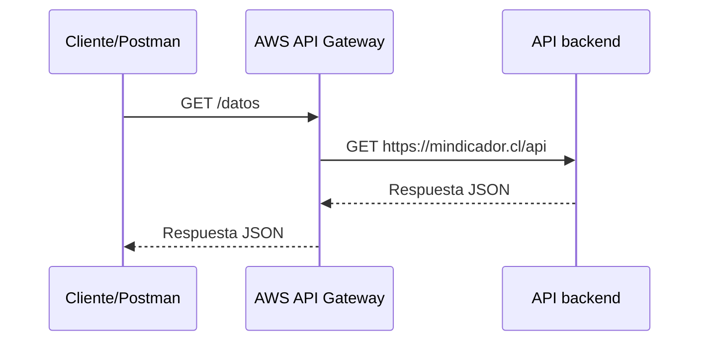

# Tutorial: Creando mi primer API Manager

En esta actividad crearás tu primer **API Manager utilizando AWS API Gateway**. La idea es construir una capa intermedia entre un cliente y una API pública existente. El cliente llamará a una ruta que tú controlarás y el API Manager redirigirá la solicitud hacia el backend real.

El flujo será el siguiente:

En este caso:

- **API Manager o API Gateway**: AWS API Gateway, la capa que recibe y controla las solicitudes.
- **API backend**: `https://mindicador.cl/api`, el servicio que proporciona los datos.
- **Ruta pública**: `/datos`, el punto de acceso que crearás en tu API.
- **Cliente**: Postman u otra herramienta capaz de realizar solicitudes HTTP.

> Esta actividad crea la integración y deja la API disponible para probarla. La autenticación y la autorización se incorporarán en actividades posteriores.

## Objetivos

Al terminar, deberás ser capaz de:

- Crear una **HTTP API** en AWS API Gateway.
- Definir una ruta `GET /datos`.
- Asociar la ruta con un backend HTTP existente.
- Crear un **Stage** y desplegar la API.
- Obtener la URL de invocación y probarla con Postman.
- Explicar la diferencia entre un API Manager y el API backend.

## Requisitos previos

Antes de empezar, comprueba que tienes:

- Acceso a AWS Academy con créditos activos.
- Permisos para utilizar API Gateway en el tenant asignado.
- Conocimientos básicos de HTTP y de los métodos `GET`, `POST`, `PUT` y `DELETE`.
- Postman instalado, u otra herramienta equivalente para probar APIs.
- Acceso a Internet para consultar `https://mindicador.cl/api`.

Utiliza la región indicada por tu institución. En los ejemplos de esta actividad se utiliza `us-east-1`. Las pantallas de AWS pueden cambiar ligeramente con el tiempo, pero el flujo general es el mismo.

## 1. Crear la API

### 1.1. Acceder a AWS Academy

1. Inicia sesión en el portal de **AWS Academy**.
2. Accede al home del tenant de AWS que te han asignado.
3. Busca y abre **API Gateway**.

Comprueba que estás trabajando en la región correcta antes de crear recursos. En la consola también pueden aparecer APIs creadas previamente; cada API es un recurso independiente.

### 1.2. Seleccionar el tipo de API

1. En la pantalla de API Gateway, selecciona **Crear API**.
2. En las opciones disponibles, elige **HTTP API**.
3. Pulsa **Crear**.

Para esta actividad utilizamos HTTP API porque necesitamos una configuración sencilla para reenviar solicitudes HTTP a un backend existente. En general, ofrece menor complejidad y puede tener menor latencia y coste que una REST API para escenarios básicos. Una REST API puede ser adecuada cuando se necesitan características más avanzadas de configuración y control.

### 1.3. Asignar un nombre

1. Introduce un nombre único, por ejemplo `API-MinIndicador` o `API-Datos-Indicadores`.
2. Selecciona **Revisar y crear**.
3. Confirma la configuración por defecto y crea la API.

En esta primera actividad no es necesario personalizar opciones adicionales.

## 2. Crear la ruta `GET /datos`

Una ruta combina un método HTTP con un recurso. En nuestro caso, el método será `GET` y el recurso será `/datos`.

1. Una vez creada la API, busca la sección de rutas y pulsa **Crear**.
2. Selecciona el método **GET**.
3. Escribe `/datos` como ruta.
4. Pulsa **Crear**.

Elegimos `GET` porque solo queremos consultar información; no vamos a crear, modificar ni eliminar datos en el backend. La ruta `/datos` es relativa a nuestra API y ofrece un nombre sencillo para el consumidor.

## 3. Asociar el backend

La ruta existe, pero todavía no sabe qué servicio debe atender las solicitudes. Ahora configurarás una integración con la API pública de indicadores.

1. En la ruta `GET /datos`, selecciona **Asociar integración**.
2. Pulsa **Crear y asociar una integración**.
3. En el tipo de integración, elige **URI de HTTP**.
4. Configura el método de la integración como **GET**.
5. En el campo **URL**, escribe exactamente: `https://mindicador.cl/api`
6. Pulsa **Crear**.

La integración debe utilizar también `GET` porque el API Manager recibirá una consulta y la reenviará como consulta al backend. A partir de este momento, una solicitud a `/datos` se dirigirá internamente a `mindicador.cl/api`.

> La API de indicadores es el backend de esta práctica. AWS API Gateway no reemplaza ese servicio: añade una capa intermedia que permite controlar, observar y proteger el acceso a él.

## 4. Revisar la configuración

Antes de desplegar, confirma que el panel muestra:

- Una ruta `GET /datos`.
- Una integración de tipo **URI de HTTP**.
- La URL de backend `https://mindicador.cl/api`.
- La ruta sin autorización o seguridad configurada.

Que aparezca sin autorización es normal en esta actividad. La autenticación, las API keys, OAuth 2.0 u otros mecanismos se añadirán más adelante.

## 5. Crear un Stage y desplegar

Una API configurada no está disponible automáticamente para los consumidores. Primero debes crear un **Stage**, que representa un entorno desplegable de la API, por ejemplo `test`, `dev` o `prod`.

1. Ve a la opción **Deploy** o a la sección de despliegue.
2. Selecciona **Crear Stage**.
3. Asigna un nombre significativo, como `test` o `prod`.
4. Pulsa **Crear**.
5. Selecciona el Stage que acabas de crear.
6. Pulsa **Deploy** para desplegar la API.
7. Espera la confirmación de que el despliegue se completó correctamente.

El Stage es importante porque separa la configuración de la API de una versión que está disponible para ser invocada. Más adelante podrías tener distintos Stages para desarrollo, pruebas y producción.

## 6. Obtener la URL de invocación

1. En el panel lateral, selecciona **API** o la sección de resumen de la API.
2. Localiza la **URL de invocación**.
3. Cópiala y guárdala para la prueba.

La URL tendrá una estructura similar a esta, aunque el identificador será diferente para cada API: `https://{id-unico}.execute-api.{region}.amazonaws.com`. Si has creado un Stage con nombre propio, la ruta completa puede incluirlo: `https://{id-unico}.execute-api.{region}.amazonaws.com/{stage}/datos`. En configuraciones con un Stage `$default`, el nombre del Stage puede no aparecer en la URL. Usa siempre la URL que muestre la consola de AWS y añade la ruta `/datos`.

## 7. Probar con Postman

1. Abre Postman.
2. Crea una nueva solicitud.
3. Selecciona el método **GET**.
4. Introduce la URL completa de tu API, por ejemplo: `https://{id-unico}.execute-api.us-east-1.amazonaws.com/{stage}/datos`
5. Pulsa **Send**.

### Resultado esperado

La solicitud debería finalizar correctamente, normalmente con el estado `200 OK`, y el cuerpo debería contener un documento JSON con datos procedentes de `mindicador.cl`, como indicadores de UF, dólar o índices bursátiles.

La URL del tutorial es solo un ejemplo. Cada estudiante tendrá un identificador de API diferente y debe utilizar su propia URL de invocación.

## Comprobación directa del backend

Si la respuesta no es la esperada, prueba primero el backend directamente desde el navegador o Postman:

`https://mindicador.cl/api`

Si el backend responde correctamente, revisa la configuración de API Gateway, el Stage seleccionado y la ruta `/datos`.

## Errores frecuentes

### Recibir un error 404

Comprueba que estás utilizando la ruta completa y que has añadido `/datos`. Revisa también si el Stage debe aparecer en la URL.

### Recibir un error 500, 502 o 504

Verifica que la integración apunta exactamente a `https://mindicador.cl/api`, que el método de integración es `GET` y que el backend está disponible. Un error 502 o 504 puede indicar que API Gateway no ha podido obtener una respuesta válida o a tiempo del backend.

### La API no responde después de crearla

Crear la ruta y la integración no basta. Asegúrate de haber creado un Stage y de haber desplegado la API en ese Stage.

### La URL no funciona en la región esperada

Comprueba la región seleccionada en la consola y utiliza la URL de invocación que proporciona AWS. No reutilices la URL de otra persona o la del ejemplo.

### La respuesta no contiene datos

Confirma que has configurado la integración con el método `GET` y que la URL del backend no contiene espacios ni caracteres adicionales.

## Preguntas de reflexión

1. ¿Qué ventajas aporta utilizar un API Manager en lugar de llamar directamente a `mindicador.cl/api` desde una aplicación?
2. ¿Qué podría ocurrir si `mindicador.cl/api` deja de estar disponible?
3. ¿Cómo protegerías esta API para evitar que cualquiera pueda acceder a ella?
4. ¿Qué diferencia hay entre `/datos` y el endpoint completo que aparece en Postman?

Algunas respuestas posibles son: control centralizado, autorización, *rate limiting*, logging, errores de integración, mecanismos de *failover* o caché, API keys, OAuth 2.0, AWS IAM y restricciones por IP. Lo importante es justificar la respuesta relacionándola con el flujo de la actividad.

## Resumen

Has creado una HTTP API en AWS API Gateway que funciona como punto de entrada controlado hacia `https://mindicador.cl/api`. La ruta `GET /datos` recibe la solicitud del cliente, el API Manager la integra con el backend y el Stage permite desplegarla para que pueda ser invocada mediante una URL pública.

En esta actividad la API todavía no tiene autorización. En las siguientes actividades podrás añadir mecanismos de identidad y seguridad sin cambiar el concepto fundamental: el cliente consume el API Manager y el API Manager controla el acceso al servicio backend.

## Recursos

- [Documentación oficial de AWS API Gateway](https://aws.amazon.com/es/api-gateway/)
- [Documentación de Postman](https://learning.postman.com/)
- [API de mindicador.cl](https://mindicador.cl/api)
- [Métodos HTTP en MDN](https://developer.mozilla.org/es/docs/Web/HTTP/Methods)
