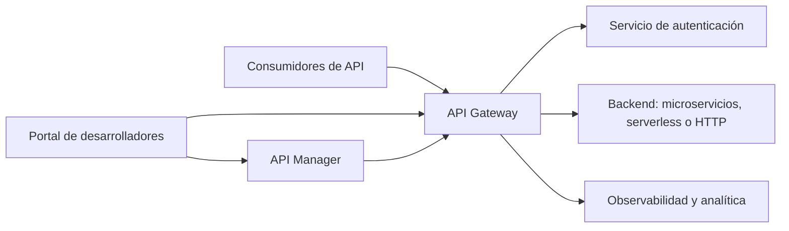

# Conociendo un API Manager

Cuando una aplicación basada en microservicios crece, sus APIs dejan de ser un detalle interno y se convierten en un punto de contacto con otros equipos, aplicaciones web, aplicaciones móviles, partners y clientes. En ese momento necesitamos algo más que varios servicios escuchando en distintos puertos: necesitamos una forma consistente de publicar, proteger, observar y gobernar esas APIs.

Ahí entra en juego un **API Manager**.

## ¿Qué es un API Manager?

Un API Manager es un servicio, normalmente gestionado, que centraliza la gestión del ciclo de vida de las APIs. Se sitúa entre los consumidores de una API y los servicios que implementan la lógica de negocio. Actúa como una **puerta de entrada** o *gateway*, pero su responsabilidad va más allá de reenviar peticiones: también ayuda a diseñar, publicar, proteger, versionar, observar y gobernar las APIs.

Entre sus funciones habituales se encuentran:

- **Publicar y organizar APIs** para que los consumidores puedan descubrirlas y utilizarlas.
- **Controlar el acceso** mediante mecanismos como API keys, OAuth 2.0 y OpenID Connect.
- **Aplicar políticas** de seguridad, transformación, validación y limitación de tráfico.
- **Observar el uso de las APIs** mediante métricas, registros y trazas.
- **Gestionar versiones** y facilitar la evolución de los contratos sin romper a los consumidores existentes.
- **Definir planes de consumo**, cuotas y límites para distintos tipos de clientes.
- **Gestionar el ciclo de vida completo** de una API, desde su diseño y publicación hasta su retirada.
- **Facilitar la monetización** cuando las APIs se ofrecen como productos o servicios para terceros.

Es importante distinguir un API Manager de un simple **API Gateway**. Un gateway suele concentrarse en el tráfico en tiempo de ejecución: enrutar solicitudes, aplicar autenticación o realizar transformaciones. Un API Manager incluye esas capacidades, pero además suele aportar un portal para desarrolladores, catálogo de APIs, analítica, gestión de suscripciones y herramientas para administrar todo el ciclo de vida.

En la práctica, algunas plataformas utilizan los términos *API Manager* y *API Gateway* de forma casi indistinta. La diferencia útil para nosotros es conceptual: el gateway gestiona principalmente el tráfico; el API Manager añade las capacidades de administración, publicación y gobierno que permiten tratar las APIs como productos.

## Arquitectura básica

La arquitectura puede variar según la plataforma, pero normalmente sigue este flujo: una aplicación consume una API a través del API Manager, el gateway aplica las políticas configuradas y la petición llega al backend correspondiente. Ese backend puede ser un microservicio en un contenedor, un servidor tradicional, una función *serverless*, una base de datos o cualquier endpoint HTTP compatible.

### Consumidores

Son las aplicaciones o equipos que utilizan las APIs: un frontend web, una aplicación móvil, otro microservicio, un sistema de un partner o un cliente externo. Cada consumidor puede tener necesidades distintas de autenticación, cuota y versión.

### API Gateway

Es el punto de entrada al que llegan las solicitudes. El gateway puede:

- Enrutar una petición hacia el microservicio correspondiente.
- Verificar tokens y credenciales.
- Aplicar *rate limiting* y cuotas.
- Transformar encabezados o formatos de datos.
- Registrar información de la solicitud y la respuesta.
- Ocultar la topología interna de los servicios.

Por ejemplo, el consumidor puede llamar a `https://api.ejemplo.com/orders`, mientras que el gateway decide que la petición debe dirigirse internamente al servicio `orders-service`.

Según el tipo de comunicación, el gateway puede exponer distintas clases de API:

- **REST APIs**: representan recursos y operaciones mediante rutas y métodos HTTP como `GET`, `POST`, `PUT` o `DELETE`.
- **HTTP APIs**: ofrecen una opción más sencilla, con menor latencia y coste en determinados escenarios, por ejemplo al invocar funciones *serverless* o endpoints HTTP públicos.
- **WebSocket APIs**: mantienen una comunicación bidireccional para enviar y recibir datos en tiempo real sin recurrir continuamente a *polling*. Son útiles para chats, notificaciones, paneles en vivo o seguimiento de eventos.

### Servicios de backend

Son los microservicios que contienen la lógica de negocio y los datos. El API Manager no reemplaza estos servicios: los expone de forma controlada y desacopla a los consumidores de detalles internos como nombres de servicios, puertos o mecanismos de despliegue.

### Servicio de identidad

En muchos escenarios, el API Manager delega la autenticación en un proveedor de identidad. Este proveedor emite y valida credenciales o tokens, por ejemplo mediante OAuth 2.0 y OpenID Connect. Después, el gateway puede comprobar el token y aplicar autorización según sus *scopes*, roles o claims.

### Portal de desarrolladores y catálogo

El portal permite descubrir las APIs, consultar su documentación, revisar ejemplos y obtener credenciales o suscripciones. Una especificación OpenAPI suele ser la base para documentar los endpoints, parámetros, respuestas y códigos de error.

### Gestión y analítica

La capa de administración permite publicar nuevas versiones, configurar políticas y consultar métricas. La analítica ayuda a responder preguntas como cuántas peticiones recibe una API, qué consumidores generan más tráfico o qué endpoints presentan más errores.

## ¿Qué problemas resuelve un API Manager?

### Exposición descontrolada de servicios

Sin una entrada común, cada microservicio puede quedar expuesto con reglas y mecanismos de seguridad diferentes. El API Manager proporciona un punto controlado para publicar los servicios y evita que la topología interna tenga que ser conocida por los consumidores.

### Complejidad de integración y retrasos

Cada consumidor podría tener que aprender una dirección, formato de autenticación y contrato diferente para cada servicio. Una fachada común, contratos documentados y políticas centralizadas reducen esa complejidad y aceleran la integración de nuevos consumidores.

### Seguridad repetida y poco consistente

Implementar autenticación, autorización, validación y registro en cada microservicio puede provocar duplicación y comportamientos distintos. El gateway permite aplicar políticas comunes, mientras que los servicios pueden seguir validando las reglas específicas del dominio que les corresponden.

Esto no significa que el backend deba confiar ciegamente en el gateway. Las decisiones críticas de autorización y las validaciones de negocio deben permanecer en el servicio que conoce el contexto de la operación.

### Cambios que rompen consumidores

Las APIs evolucionan: se añaden campos, se modifican respuestas o se publican nuevas operaciones. El versionado y la gestión del ciclo de vida permiten mantener una versión anterior durante una transición y comunicar cuándo dejará de estar disponible.

### Tráfico impredecible

Un cliente defectuoso o un pico de demanda puede saturar un servicio. Con *rate limiting*, cuotas y políticas de protección, el API Manager puede limitar el número de peticiones por consumidor y ayudar a proteger el backend.

### Sobrecarga de infraestructura y operación manual

Mantener de forma manual balanceadores, reglas de acceso, certificados, rutas y mecanismos de protección puede consumir mucho tiempo y aumentar el riesgo de errores. Un API Manager gestionado reduce parte de esa carga operativa y permite aplicar configuraciones de forma repetible.

### Falta de visibilidad

Cuando las peticiones pasan directamente entre aplicaciones y microservicios, resulta difícil saber quién consume cada API y dónde se producen los errores. Las métricas, los logs y las trazas centralizadas permiten observar el comportamiento del sistema y detectar problemas con mayor rapidez.

### Dificultad para trabajar con equipos externos

Un portal de desarrolladores y una documentación uniforme reducen la dependencia de explicaciones manuales. Los consumidores pueden encontrar el contrato, probar la API y conocer las condiciones de uso desde un mismo lugar.

## Casos de uso

### APIs para aplicaciones web y móviles

Una organización puede ofrecer una fachada estable para sus aplicaciones cliente mientras cambia internamente sus microservicios. El API Manager centraliza la autenticación, aplica cuotas diferentes para aplicaciones móviles y web, y facilita la observabilidad del tráfico.

### Funciones *serverless* y endpoints HTTP

Una API puede activar una función cuando recibe una solicitud, sin que el equipo tenga que administrar servidores permanentemente. Este patrón resulta útil para operaciones pequeñas, procesamiento bajo demanda y cargas variables. También permite publicar endpoints HTTP existentes con una capa común de seguridad y control.

### Comunicación en tiempo real

Una aplicación de colaboración, un sistema de notificaciones o un panel de monitorización puede utilizar WebSocket para mantener una conexión abierta y recibir eventos en tiempo real. Así se evita que el cliente tenga que consultar repetidamente si existen novedades.

### Integración entre microservicios

Aunque no todas las comunicaciones internas necesitan pasar por un API Manager, puede ser útil para exponer determinados servicios de forma uniforme. Por ejemplo, un equipo puede publicar una API de catálogo para que otros equipos la consuman sin conocer cómo está desplegado el servicio.

Para comunicación interna de alta frecuencia o muy sensible a la latencia, también conviene evaluar alternativas como la comunicación directa, un *service mesh* o mensajería asíncrona.

### APIs para partners

Un partner externo puede necesitar consultar pedidos o enviar actualizaciones. El API Manager permite crear credenciales específicas, restringir los permisos, limitar el consumo y medir el tráfico de ese partner sin mezclarlo con el de otros consumidores.

### Exposición de capacidades a terceros

Una empresa puede convertir funcionalidades internas en productos digitales: pagos, geolocalización, facturación o consulta de disponibilidad. El portal, las suscripciones y los planes de consumo ayudan a ofrecer estas capacidades de manera controlada.

### Migración gradual de sistemas legacy

Durante una modernización, el API Manager puede presentar un contrato uniforme mientras algunas operaciones siguen respaldadas por sistemas legacy y otras ya utilizan microservicios. Así se reduce el acoplamiento de los clientes con la tecnología de cada backend y se facilita una migración progresiva.

### APIs públicas y autoservicio

Cuando una API se ofrece a muchos consumidores, el autoservicio es especialmente valioso. La documentación, las claves o suscripciones, las cuotas y las métricas pueden gestionarse desde el portal sin que el equipo propietario tenga que intervenir en cada alta.

## Resumen

Un API Manager ayuda a convertir un conjunto de endpoints en un producto gobernado: con seguridad, documentación, control del consumo, observabilidad y una estrategia de evolución. No sustituye a los microservicios ni resuelve por sí solo los problemas de diseño de una API, pero proporciona una capa común para exponer sus capacidades de forma coherente y sostenible.

La decisión de incorporar uno debe partir de las necesidades del sistema. En una aplicación pequeña puede ser suficiente un gateway sencillo; en un ecosistema con muchos consumidores, partners, requisitos de seguridad y varias versiones, las capacidades de gestión suelen aportar un valor significativo.
